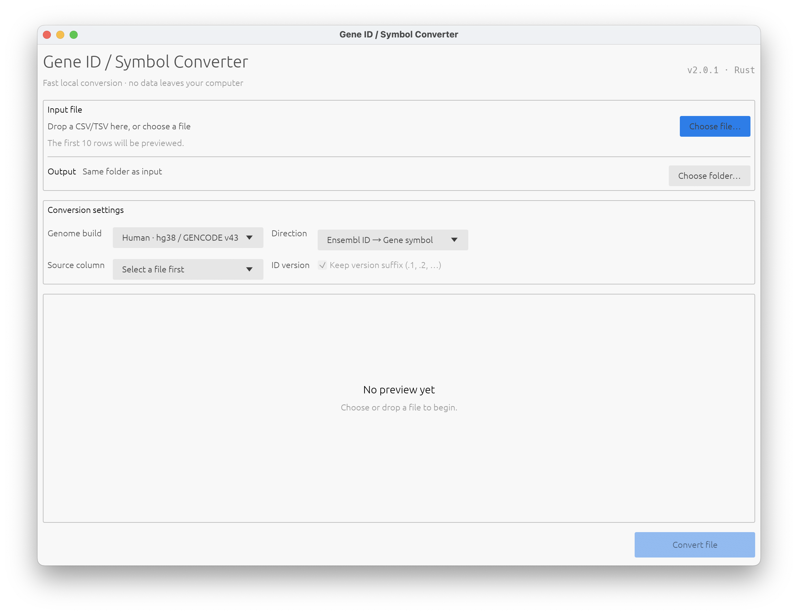

# GeneConverter

GeneConverter is a fast, native, cross-platform desktop application for converting gene identifiers and symbols. Version 2.0.1 is written in Rust with egui and supports Windows, macOS (Apple Silicon and Intel), and Linux from a single codebase.



## Features

- Convert Ensembl IDs to gene symbols.
- Convert gene symbols or aliases to Ensembl IDs.
- Use bundled `hg38 / GENCODE v43` and `mm10 / GENCODE v25` mappings.
- Read CSV, TSV, and TXT files while preserving quoted fields, commas, and empty values.
- Preview the first 10 rows and choose the source column before conversion.
- Optionally preserve Ensembl version suffixes such as `.1` and `.2`.
- Deduplicate multiple matches and join them with commas.
- Drag and drop files, select an output folder, track progress, cancel a conversion, and confirm overwrites.
- Work completely offline: mapping tables are embedded in the application and no data leaves your computer.

## Opening an unsigned macOS build

Release artifacts are unsigned unless the repository's Apple signing secrets are configured. If macOS blocks the application after you have downloaded it from this repository's GitHub Releases page and verified its checksum, move the application to /Applications, then remove its quarantine attribute:

```bash
xattr -dr com.apple.quarantine "/Applications/GeneConverter.app"
```
Only run this command for an application whose source you trust. It recursively removes the Gatekeeper quarantine attribute from that application bundle.


## Run from Source

[Rust stable](https://www.rust-lang.org/tools/install) 1.95 or later is required.

```bash
cargo run --release
```

The first build downloads the Rust dependencies. The `hg38_table.csv` and `mm10_table.csv` mapping files are embedded at compile time.

On Ubuntu or Debian, install the required window-system libraries before building:

```bash
sudo apt-get update
sudo apt-get install -y libgtk-3-dev libxkbcommon-dev \
  libxcb-render0-dev libxcb-shape0-dev libxcb-xfixes0-dev libssl-dev
```

## Usage

1. Drop a `.csv`, `.tsv`, or `.txt` file into the window, or choose one with the file picker.
2. Select the genome build, conversion direction, and source column.
3. For symbol-to-ID conversion, choose whether to preserve version suffixes.
4. Optionally select an output directory, then click **Convert File**.

By default, the result is saved next to the input file as `<original_name>_converted.<extension>`. Unmatched values are preserved. The new column is named `<source_column>_symbol` or `<source_column>_ensembl`.

## Test and Build

```bash
cargo fmt --all -- --check
cargo clippy --all-targets --all-features -- -D warnings
cargo test --all-targets
cargo build --release
```

To create a macOS `.app` bundle with `cargo-bundle`:

```bash
cargo install cargo-bundle
cargo bundle --release
```

The macOS application is created at `target/release/bundle/osx/GeneConverter.app`. The Windows executable is created at `target/release/gene-converter.exe`, and the Linux executable at `target/release/gene-converter`.

GitHub Actions tests and packages the application for:

- Windows x86_64
- macOS Apple Silicon
- macOS Intel
- Linux x86_64

Pushing a version tag such as `v2.0.1` creates a GitHub Release and attaches archives for all four targets.

## Project Structure

```text
src/lib.rs                  Streaming conversion engine, mapping cache, and unit tests
src/main.rs                 Cross-platform native GUI
hg38_table.csv              Human gene mapping table
mm10_table.csv              Mouse gene mapping table
screenshot.png              Application screenshot used in this README
.github/workflows/build.yml Cross-platform CI and release workflow
```

## License

[MIT](LICENSE)
